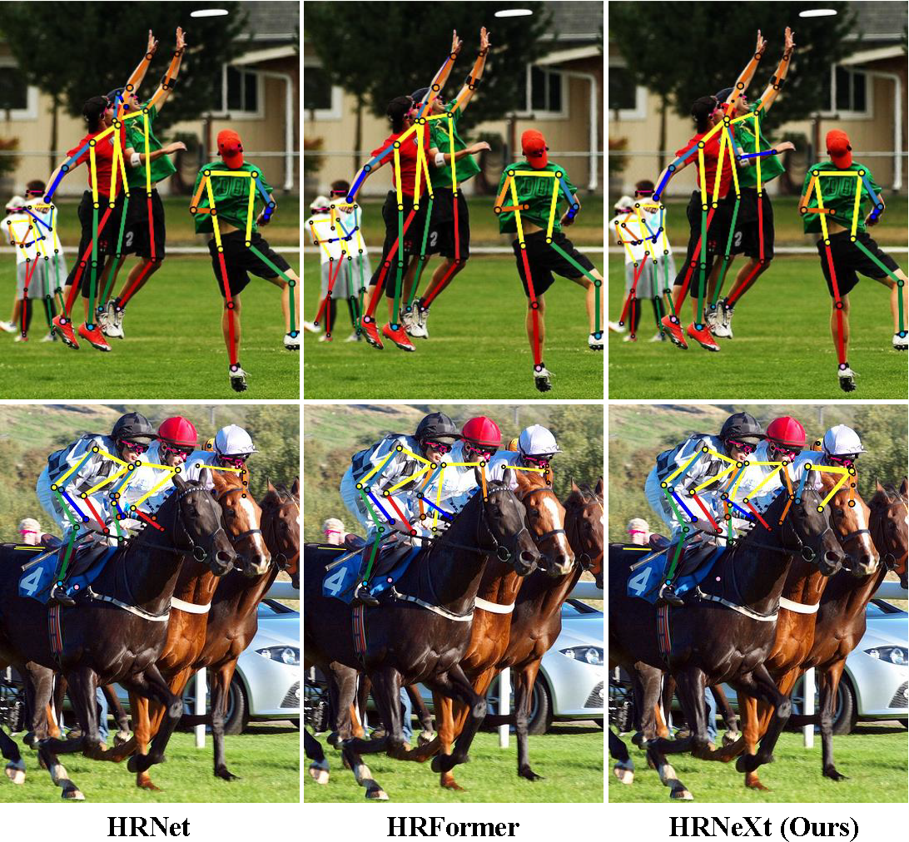

# HRNeXt: High-Resolution Context Network

## Introduction
This is an official repository of our paper ***HRNeXt: High-Resolution Context Network for Crowd Pose Estimation*** (submitted to *IEEE Transactions on Multimedia*). In this work, we present a novel network backbone High-Resolution Context Network for Crowd Pose Estimation (HRNeXt), which learns high-resolution representations with abundant contextual information to better estimate poses of occluded human bodies. Compared to state-of-the-art pose estimation networks, our HRNeXt is more efficient in terms of training data size, network parameters and computational cost. Experimental results show that our HRNeXt significantly outperforms state-of-the-art backbone networks on challenging pose estimation datasets with high occurrence of crowds and occlusions.

It is hoped that our HRANet will be a perfect substitute for other widely-used backbone networks (e.g. [HRNet](https://github.com/HRNet/HRNet-Human-Pose-Estimation), [HRFormer](https://github.com/HRNet/HRFormer), etc.) on dense prediction tasks, since our backbone can achieve much better performance in terms of trade-off between accuracy and computational complexity.

## News

- ***Open source***: Coming soon, so be sure to stay tuned!
- Part of our experimental results are demonstrated below:

#### Comparison with [HRNet](https://github.com/HRNet/HRNet-Human-Pose-Estimation) and [HRFormer](https://github.com/HRNet/HRFormer) using bounding boxes from a human detector on the COCO `val2017` dataset

| Backbone | Pretrain | Input Size | #Params | FLOPs | AP | AP50 | AP75 | APM | APL | AR |
| :----------------- | :------: | :-----------: | :-----------: | :------: |:------: | :------: | :------: | :------: | :------: | ------------------ |
| HRNet-W32 | Y | 256×192 | 28.5M | 7.1G | 0.734 | 0.895 | 0.807 | 0.702 | 0.801 | 0.789 |
| HRNet-W32 | Y | 384×288 | 28.5M | 16.0G | 0.758 | 0.906 | 0.827 | 0.719 | 0.828 | 0.810 |
| HRNet-W48 | Y | 256×192 | 63.6M | 14.6G | 0.751 | 0.906 | 0.822 | 0.715 | 0.818 | 0.804 |
| HRNet-W48 | Y | 384×288 | 63.6M | 32.9G | 0.763 | 0.908 | 0.829 | 0.723 | 0.834 | 0.812 |
| HRFormer-S | Y | 256×192 | 7.8M | 2.8G | 0.740 | 0.902 | 0.812 | 0.704 | 0.807 | 0.794 |
| HRFormer-S | Y | 384×288 | 7.8M | 6.2G | 0.756 | 0.903 | 0.822 | 0.716 | 0.825 | 0.807 |
| HRFormer-B | Y | 256×192 | 43.2M | 12.2G | 0.756 | 0.908 | 0.828 | 0.717 | 0.826 | 0.808 |
| HRFormer-B | Y | 384×288 | 43.2M | 26.8G | 0.772 | 0.910 | 0.836 | 0.732 | 0.842 | 0.820 |
| **HRNeXt-S (Ours)** | **N** | **256×192** | **9.5M** | **2.5G** |**0.761** | **0.906** | **0.834** | **0.728** | **0.827** | **0.813** |
| **HRNeXt-B (Ours)** | **N** | **384×288** | **31.7M** | **10.8G** | **0.770** | **0.911** | **0.835** | **0.732** | **0.841** | **0.820** |

#### Comparison with [HRNet](https://github.com/HRNet/HRNet-Human-Pose-Estimation) and [HRFormer](https://github.com/HRNet/HRFormer) using ground-truth bounding box on the OCHuman `val` dataset.

| Backbone            | Pretrain | Input Size  |  #Params  |   FLOPs   |    AP     | AP50 | AP75 | APM | APL |    AR     |
| :------------------ | :------: | :---------: | :-------: | :-------: | :-------: | :-------------: | :-------------: | :------------: | :------------: | :-------: |
| HRNet-W32           |    Y     |   256×192   |   28.5M   |   7.1G    |   0.631   |      0.794      |      0.690      |     0.642      |     0.631      |   0.673   |
| HRNet-W32           |    Y     |   384×288   |   28.5M   |   16.0G   |   0.637   |      0.784      |      0.690      |     0.643      |     0.637      |   0.676   |
| HRNet-W48           |    Y     |   256×192   |   63.6M   |   14.6G   |   0.645   |      0.794      |      0.701      |     0.651      |     0.645      |   0.685   |
| HRNet-W48           |    Y     |   384×288   |   63.6M   |   32.9G   |   0.650   |      0.784      |      0.703      |     0.684      |     0.650      |   0.688   |
| HRFormer-S          |    Y     |   256×192   |   7.8M    |   2.8G    |   0.584   |      0.757      |      0.633      |     0.647      |     0.584      |   0.631   |
| HRFormer-S          |    Y     |   384×288   |   7.8M    |   6.2G    |   0.595   |      0.756      |      0.640      |     0.641      |     0.595      |   0.642   |
| HRFormer-B          |    Y     |   256×192   |   43.2M   |   12.2G   |   0.603   |      0.749      |      0.647      |     0.640      |     0.603      |   0.647   |
| HRFormer-B          |    Y     |   384×288   |   43.2M   |   26.8G   |   0.625   |      0.762      |      0.660      |     0.652      |     0.625      |   0.665   |
| **HRNeXt-S (Ours)** |  **N**   | **256×192** | **9.5M**  | **2.5G**  | **0.631** |    **0.784**    |    **0.681**    |   **0.648**    |   **0.631**    | **0.670** |
| **HRNeXt-B (Ours)** |  **N**   | **384×288** | **31.7M** | **10.8G** | **0.671** |    **0.805**    |    **0.716**    |   **0.706**    |   **0.672**    | **0.706** |

#### Example pose estimation results from HRNet vs. HRFormer vs. HRNeXt in crowded scenes with heavy occlusions. 

Benefiting from the superb context modeling ability, our HRNeXt can detect more keypoints and better estimate poses of occluded human bodies.

